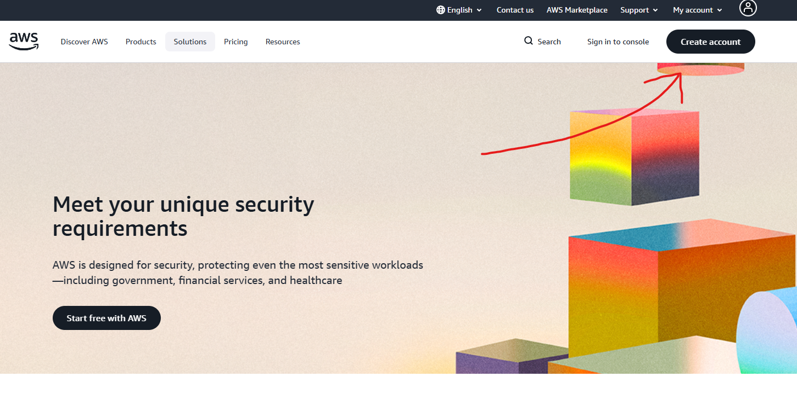
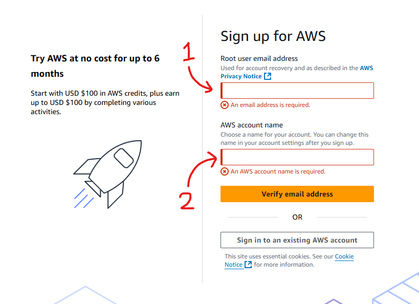
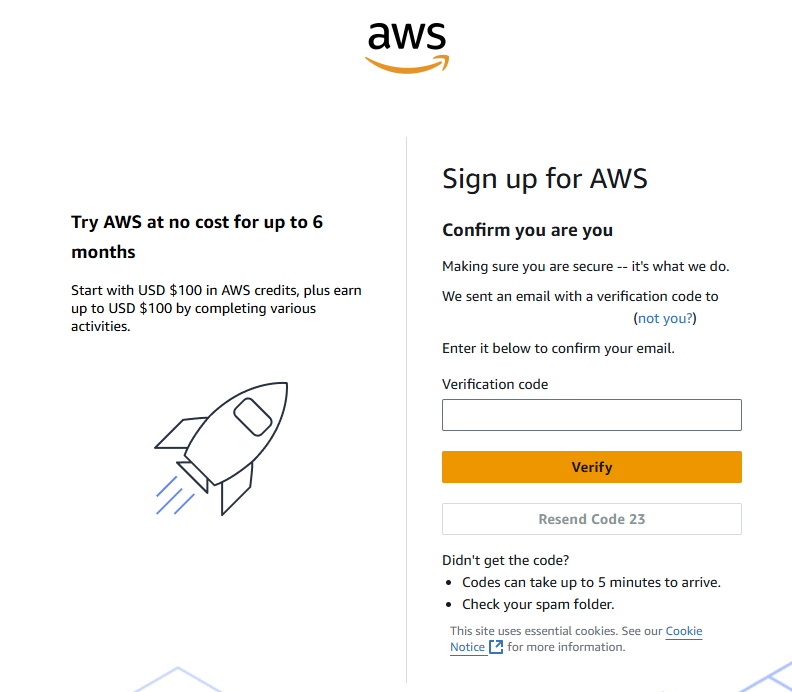
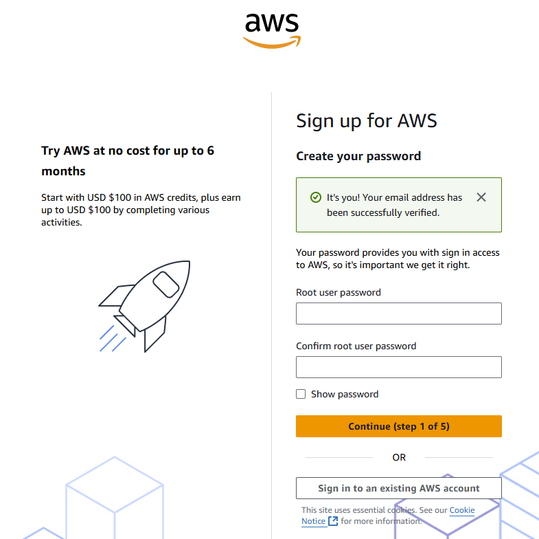
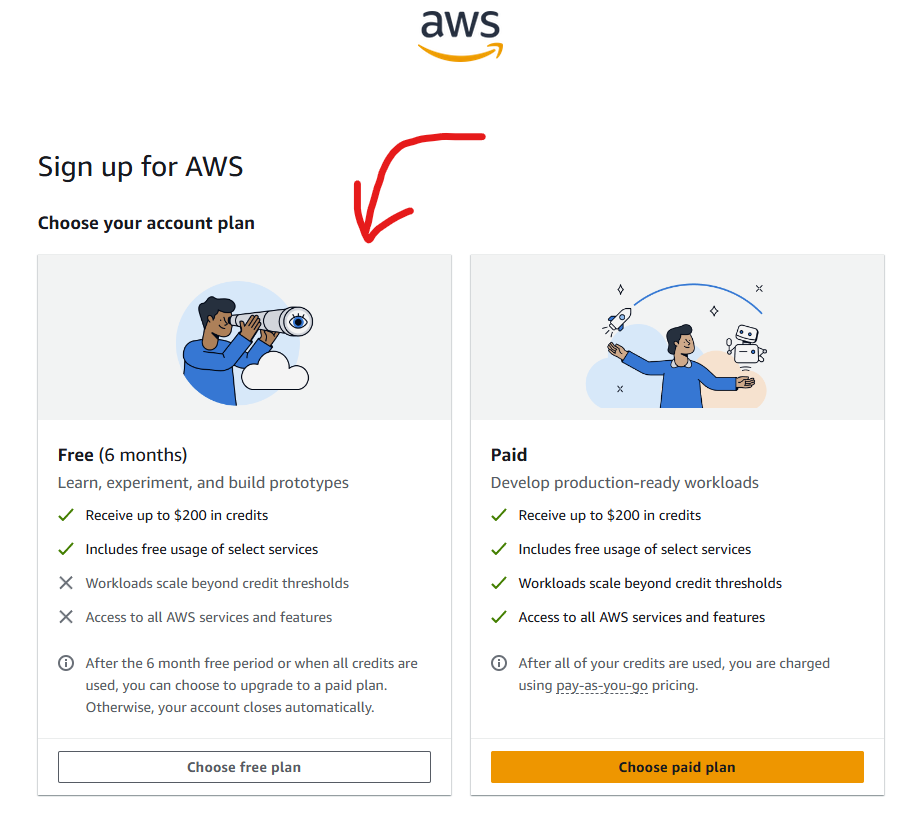
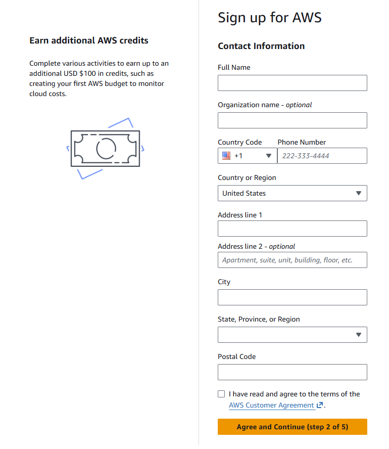
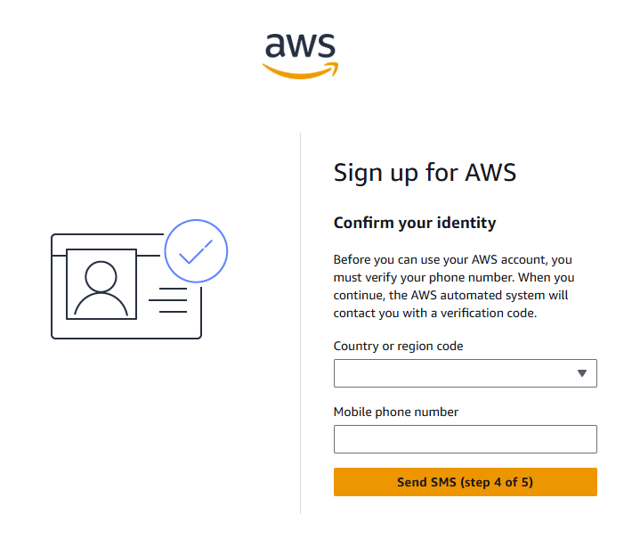

# How to Create a Free AWS Account

1. Go to [https://aws.amazon.com/](https://aws.amazon.com/)

2. Click on the **Create account** button.

   

3. Fill in the first box with your email and the second box with your chosen AWS account name.

   

4. Verify email address.

   

5. Create password then click **Continue**.

   

6. Click the **"Choose free plan"** button.

   

7. Fill out billing information as follows:

   | Field                          | What to Enter                                         |
   | ------------------------------ | ----------------------------------------------------- |
   | Full name                      | Enter full name                                       |
   | Organization name _(optional)_ | Enter name of organization                            |
   | Country Code                   | Enter code of country you are in                      |
   | Phone Number                   | Enter your phone number                               |
   | Country or Region              | Choose your country or region                         |
   | Address line 1                 | Enter your address                                    |
   | City                           | Enter name of city you are in                         |
   | State, Province, or Region     | Choose State, Province, or Region which matches yours |
   | Postal Code                    | Enter postal code for your address                    |

   

8. Tick the **"I have read and agree to the terms of the AWS Customer Agreement"** checkbox.

9. Press the **"Agree and continue"** button.

10. Fill in your billing information as follows:

    | Field                       | What to Enter                                    |
    | --------------------------- | ------------------------------------------------ |
    | Credit or Debit card number | Enter your card number here                      |
    | Expiration date             | Select the correct expiration date for your card |
    | Security code               | Enter your CVV or CVC                            |
    | Cardholder's name           | Enter the name that the card is attached to      |
    | Billing address             | Set the billing address to match your card       |

11. Click the **"Continue"** button.

12. Click the **"Send SMS"** button — make sure the country or region code is correct and that your mobile number is correct.

    

13. Enter the SMS code into the field and press **Continue**.

14. You should now be logged in and on the home page of your AWS account.

> **Tip:** Save the login page URL so you can access it later.
>
> **Tip:** Save your email address and password in a secure place.
