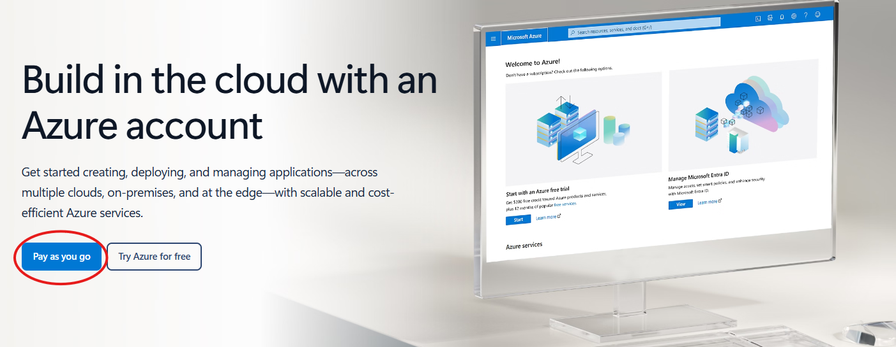
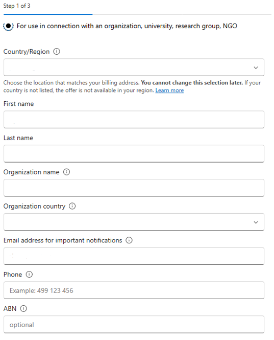
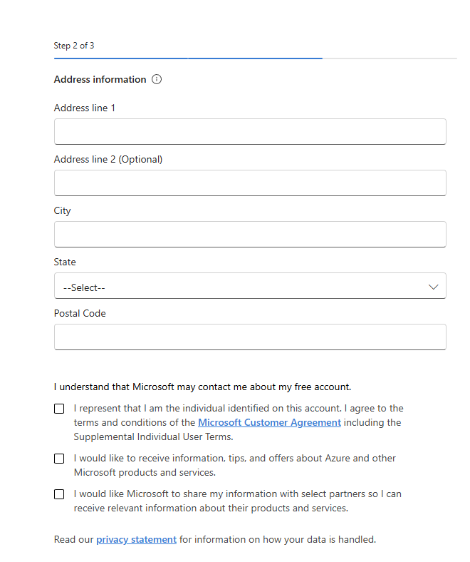
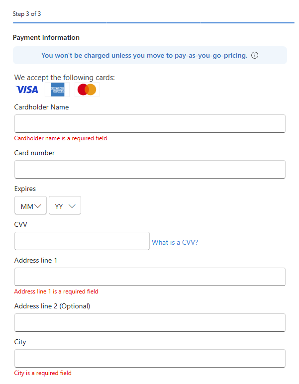
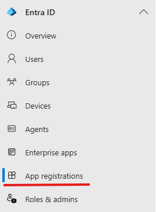
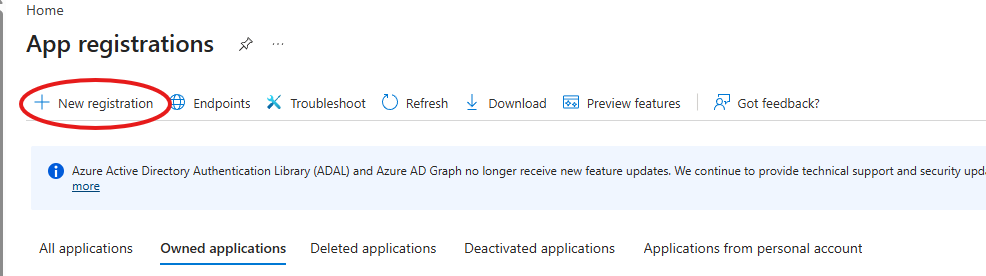
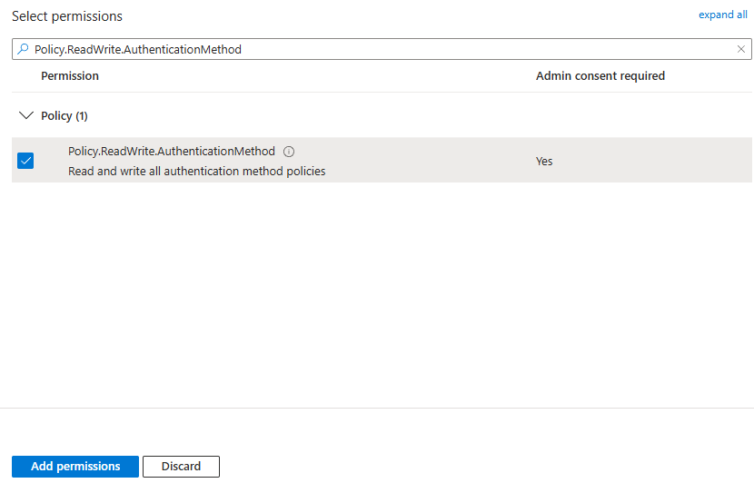

# Microsoft Entra & Azure Setup

## Creating org Microsoft account

This guide walks through the steps required to create a Microsoft Entra ID tenant while signing up for an Azure free trial. The process consists of three main stages:

### Start the Azure Free Trial

1. Navigate to the Azure signup page.  
   [https://azure.microsoft.com/en-gb/free/entra-id](https://azure.microsoft.com/en-gb/free/entra-id)

2. Select **Pay as you go**.



3. You will be prompted to sign in with an existing Microsoft account or create a new one.

4. After signing in, the system begins a three-step registration process.

### Step 1 of 3 — Organization & Contact Information



This step establishes who is creating the tenant and which organization it belongs to.

**Fields to Complete**

| **Field**                                     | **What to Enter**                                        | **Notes**                                               |
| --------------------------------------------- | -------------------------------------------------------- | ------------------------------------------------------- |
| **Personal use or for organization**          | Choose "for use in connection with an organization…"     | Cannot be changed later                                 |
| **Country/Region**                            | Select the country that matches your **billing address** | Cannot be changed later                                 |
| **First name**                                | Your legal first name                                    | Used for identity verification                          |
| **Last name**                                 | Your legal last name                                     | Used for identity verification                          |
| **Organization name**                         | Name of your organization                                | This becomes part of your Azure billing profile         |
| **Organization country**                      | Country where the organization is registered             | Often autofilled based on earlier selection             |
| **Email address for important notifications** | Your work email                                          | Azure sends billing, security, and service alerts here  |
| **Phone**                                     | A valid mobile or landline number                        | Used for identity verification                          |
| **ABN (optional)**                            | Leave this section empty                                 | Optional but recommended for organizations in Australia |

### Step 2 of 3 — Address & Agreements

This step collects your physical address and requires you to accept Microsoft's terms.



**Fields to Complete**

| **Field**          | **What to Enter**             | **Notes**                                   |
| ------------------ | ----------------------------- | ------------------------------------------- |
| **Address line 1** | Primary business address      | Required                                    |
| **Address line 2** | Suite, unit, or building info | Optional                                    |
| **City**           | City or suburb                | Required                                    |
| **State**          | Select from the dropdown      | Required                                    |
| **Postal Code**    | Valid postal code             | Required; form will not continue without it |

**Required Agreements**

You must check the box confirming:

- You are the individual identified on the account, and you agree to the **Microsoft Customer Agreement** and **Supplemental Individual User Terms**

**Optional Communication Preferences**

You may choose to opt in to:

- Product updates, tips, and offers from Microsoft

- Information from Microsoft partners

These do not affect your ability to proceed.

### Step 3 of 3 — Payment Verification

Azure requires a valid payment method to prevent fraud and confirm identity. **You will not be charged unless you later upgrade to Pay As You Go.**



**Fields to Complete**

| **Field**           | **What to Enter**                           | **Notes** |
| ------------------- | ------------------------------------------- | --------- |
| **Cardholder Name** | Name exactly as it appears on the card      | Required  |
| **Card Number**     | Valid Visa, Mastercard, or American Express | Required  |
| **Expiry (MM/YY)**  | Select month and year                       | Required  |
| **CVV**             | 3 or 4-digit security code                  | Required  |
| **Address line 1**  | Billing address for the card                | Required  |
| **Address line 2**  | Optional                                    |           |
| **City**            | City or suburb                              | Required  |
| **State**           | Select from the dropdown                    | Required  |
| **Postal Code**     | Valid postal code                           | Required  |

**Purpose of This Step**

- Identity verification

- Fraud prevention

- Ensures eligibility for the free trial

Once submitted, Microsoft will validate your card and complete the tenant creation.

### Completion

After all three steps are successfully submitted:

- Your **Azure subscription** is created

- Your **Microsoft Entra ID tenant** is provisioned

- You can immediately begin configuring users, groups, applications, and security settings

## Creating admin app registration

1. Navigate to Entra admin centre

2. Look for App registrations and click on it



3. Click on New registration



4. Give the application a name like 'corpDeployer'

5. Choose Single tenant only as a Supported account type

6. Click **Register** at the bottom

7. You will be taken to the app's overview page. Copy the Application (client) ID and Directory (tenant) ID values somewhere secure to be accessed later.

8. Go to **certificates and secrets** from the overview page

9. Click **+ New client secret**

10. Add a description and select desired expiration date

11. Click **Add**

12. **CRUCIAL:** Copy the string inside the **Value** column immediately and save it to a secure place. (Once you leave this page, the Value is permanently masked with asterisks, and you can never retrieve it again)

13. Now on the left menu, click **API permissions**

14. By default, the app will have a basic delegated permission (User.Read). Click **+ Add a permission**

15. Select **Microsoft Graph** from the list of available APIs

16. Choose **Application permissions**

17. In the search box, type: Policy.ReadWrite.AuthenticationMethod

18. Expand the **Policy** section, check the box next to Policy.ReadWrite.AuthenticationMethod, and click **Add permissions** at the bottom



19. Click **+ Add a permission** again

20. Select **Microsoft Graph** from the list of available APIs

21. Choose **Application permissions**

22. In the search box, type: Domain.ReadWrite.All

23. Expand the **Domain** section check the box next to Domain.ReadWrite.All, and click **Add permissions** at the bottom

24. do this again for the permission "UserAuthMethod-TAP.ReadWrite.All"

25. You will return to the permissions table, and the status will show _Not granted for [Your Org]_

26. Click the button right above the table that says **Grant admin consent for [Your Org Name]**

27. Click **Yes** when prompted to confirm

28. The app should now be granted that permission.

29. Now on the far-left menu click on **Roles & admins**

30. In the search bar type "Cloud Application Administrator"

31. Click on the role

32. Click **+ Add assignments**

33. In the search bar paste in your app registration's Application (client) ID

34. Select the tick box next to your app registration and click **Add**

35. Your app registration should now have the Cloud Application Administrator role

## Plugging app registration into Terraform

1. create a file in corpSetup called corp.env

1. paste the following into the corp.env file:

   ```
   tenant_id     = your-actual-tenant-id
   client_id     = your-actual-client-id
   client_secret = your-actual-client-secret-value
   ```

1. replace 'your-actual-tenant-id' with your app registration's actual tenant id

1. replace 'your-actual-client-id' with your app registration's actual client id

1. replace 'your-actual-client-secret' with your app registration's actual client secret value
